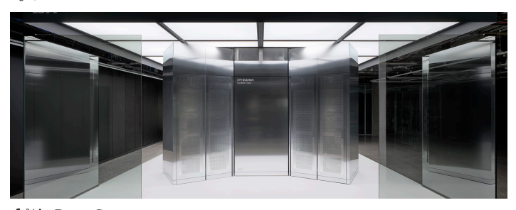
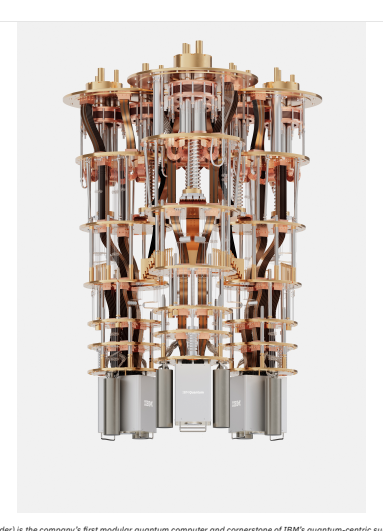

# Ibm And Amd Join Forces To Build The Future Of Computing

Companies aim to merge AI accelerators, quantum computers, and high-performance computing to help solve a wide range of the world's *most* difficult *problems* Aug 26, **2025**

## 

YORKTOWN HEIGHTS, N.Y. and AUSTIN, Texas, Aug. 26, 2025 /PRNewswire/ -- Today, IBM (NYSE: IBM) and AMD (NASDAQ: AMD) **announced** plans to develop next-generation computing architectures based on the combination of quantum computers and high-performance **computing,** known as quantum-centric supercomputing. AMD and IBM are collaborating to develop scalable, open-source platforms that could redefine the future of computing, leveraging IBM's leadership in developing the world's most performant quantum computers and software, and **AMD's** leadership in high-performance computing and AI **accelerators.** Quantum computing is a completely different way to represent and process information. While classical computers use bits that can only be **either** a zero or one, quantum computers' qubits represent information according to the quantum mechanical laws of nature. These properties **enable** a much richer computational space to explore solutions to complex problems beyond the reach of classical computing alone, including in fields **such** as drug discovery, materials discovery, optimization, and **logistics.**

IBM Quantum System Two (interior render) is the company's first modular quantum computer and cornerstone of IBM's quantum-centric supercomputing architecture. Credit: IBM
"Quantum computing will simulate the natural world and represent information in an entirely new way," said Arvind Krishna, Chairman and **CEO,** IBM. "By exploring how quantum computers from IBM and the advanced high-performance compute technologies of AMD can work **together,** we will build a powerful hybrid model that pushes past the limits of traditional **computing."** "High-performance computing is the foundation for solving the world's most important challenges," said Dr. Lisa Su, Chair and CEO of AMD. "As we partner with IBM to explore the convergence of high-performance computing and quantum technologies, we see tremendous **opportunities** to accelerate discovery and **innovation."** In a quantum-centric supercomputing architecture, quantum computers work in tandem with powerful high-performance computing and AI infrastructure, which are typically supported by CPUs, GPUs and other compute engines. In this hybrid approach, different **components** of a problem are tackled by the paradigm best suited to solve them. For example, in the future, quantum computers could simulate the **behavior** of atoms and molecules, while classical supercomputers powered by AI could handle massive data analysis. Together, these technologies **could** tackle real-world problems at unprecedented speed and **scale.** AMD and IBM are exploring how to integrate AMD CPUs, GPUs, and FPGAs with IBM quantum computers to efficiently accelerate a new **class** of emerging algorithms, which are outside the current reach of either paradigm working independently. The proposed effort could also help **progress** IBM's vision to deliver fault-tolerant quantum computers by the end of this decade. AMD technologies offer promise for providing real-time **error** correction capabilities, a key element of fault-tolerant quantum **computing.** The teams are planning an initial demonstration later this year to show how IBM quantum computers can work in tandem with AMD **technologies** to deploy hybrid quantum-classical workflows. The companies also plan to explore how open-source ecosystems, such as Qiskit, could **catalyze** the development and adoption of new algorithms that leverage quantum-centric **supercomputing.** IBM has already initiated the first steps towards a vision in which quantum and classical computing are seamlessly integrated, including a **recent** partnership with RIKEN to deploy and directly connect IBM's modular quantum computer, IBM Quantum System Two, with Fugaku, one of the world's fastest classical supercomputers; as well as work with industry leaders such as Cleveland Clinic, the Basque Government, and **Lockheed**
 2/4 Martin to demonstrate how combining quantum and classical resources could return valuable results for difficult problems, beyond what **classical**
computers can do on their **own.** AMD CPUs and GPUs power Frontier at the U.S. Department of Energy's Oak Ridge National Laboratory—the first supercomputer in **history** to officially break the exascale barrier. Today, AMD EPYC™ CPUs and AMD Instinct™ GPU technology also drive El Capitan at Lawrence **Livermore** National Laboratory, giving AMD the distinction of powering the two fastest supercomputers in the world, according to the TOP500 list. **Beyond** high-performance computing, AMD CPUs, GPUs and open-source software also power numerous generative AI solutions for leading **enterprises** and cloud providers around the **world.**

## About Ibm

IBM is a leading provider of global hybrid cloud and AI, and consulting expertise. We help clients in more than 175 countries capitalize on **insights** from their data, streamline business processes, reduce costs and gain the competitive edge in their industries. Thousands of governments and corporate entities in critical infrastructure areas such as financial services, telecommunications and healthcare rely on IBM's hybrid **cloud** platform and Red Hat OpenShift to affect their digital transformations quickly, efficiently and securely. IBM's breakthrough innovations in AI, quantum computing, industry-specific cloud solutions and consulting deliver open and flexible options to our clients. All of this is backed by **IBM's** long-standing commitment to trust, transparency, responsibility, inclusivity and service. Visit ibm.com for more **information.**

## About Amd

For more than 55 years AMD has driven innovation in high-performance computing, graphics and visualization technologies. Billions of **people,** leading Fortune 500 businesses and cutting-edge scientific research institutions around the world rely on AMD technology daily to improve how they live, work and play. AMD employees are focused on building leadership high-performance and adaptive products that push the **boundaries** of what is possible. For more information about how AMD is enabling today and inspiring tomorrow, visit the AMD (NASDAQ: AMD) website, **blog,** LinkedIn, Facebook and X **pages.**

## Media Contacts: Ibm

Brittany Forgione, IBM **Communications** Brittany.forgione@ibm.com

## Amd

Aaron Grabein, AMD **Communications** Aaron.Grabein@amd.com SOURCE IBM IBM Quantum System Two IBM Quantum System Two interior **render**
Subscribe to **email**
Release **Categories**
Research and **innovation**
more **articles** IBM and AMD Join Forces to Build the **Future** of **Computing** IBM and NASA Release **Groundbreaking** Open-Source AI Model on Hugging **Face** to Predict Solar Weather and Help **Protect** Critical **Technology** IBM and the USTA Roll Out AI-Powered Fan Experiences for 2025 US **Open**
Subscribe to **email**